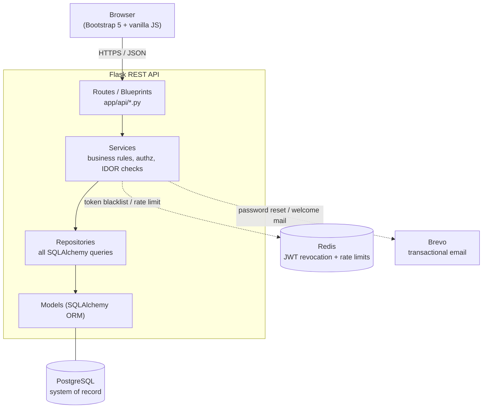
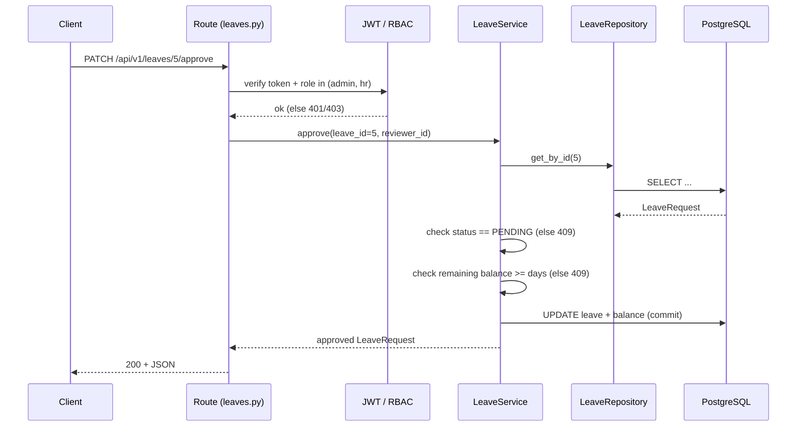
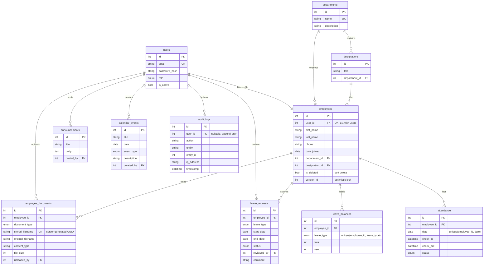

# Architecture & Data Model

Diagrams below are written in [Mermaid](https://mermaid.js.org/) and render
natively on GitHub.

## System Architecture

The backend follows a strict layered architecture — each layer only calls the
layer directly beneath it.

## Request Lifecycle (example: approve a leave request)

## Entity–Relationship Diagram

## Key schema decisions

- **`users` and `employees` are separate tables** — authentication identity is
  kept independent of HR profile data (single responsibility at the schema level).
- **Soft delete** (`employees.is_deleted`) preserves referential integrity:
  attendance/leave/document rows keep pointing at a valid employee row.
- **Optimistic concurrency** (`employees.version_id`) — SQLAlchemy rejects a
  second concurrent update with a `StaleDataError` instead of silently
  overwriting the first user's change.
- **`audit_logs` is append-only** — no `updated_at`, no soft-delete column.
- **DB-level constraints as defense in depth**: `end_date >= start_date`,
  unique `(employee_id, date)` on attendance, unique `(employee_id, leave_type)`
  on balances — enforced by the database, not just the API layer.
